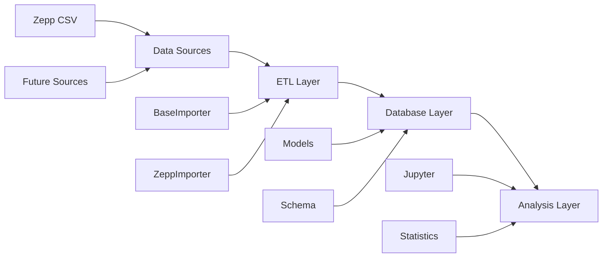

# Health Data Analytics System

A comprehensive, extensible system for importing, storing, and analyzing health data from various sources. The system follows best practices with modular architecture, supporting multiple data types and sources.

## Features

### 🏗️ **Modular Architecture**
- **Extensible Design**: Easy to add new data sources and types
- **Abstract Base Classes**: Consistent interfaces for importers and models
- **Separation of Concerns**: Clear separation between database, ETL, and analysis layers

### 📊 **Multi-Data Type Support**
- **Activity Data**: Steps, calories, distance, active minutes
- **Sleep Data**: Sleep stages, efficiency, duration, timestamps
- **Heart Rate Data**: Continuous and resting heart rate (ready for future data)
- **User Management**: Multi-user support with proper relationships

### 🔌 **Data Source Support**
- **Zepp Devices**: Complete support for Zepp CSV exports
- **Extensible Framework**: Easy to add Fitbit, Apple Health, Garmin, etc.

### 🛡️ **Data Quality & Validation**
- **Input Validation**: Comprehensive data validation and cleaning
- **Error Handling**: Robust error handling with detailed logging
- **Batch Processing**: Efficient batch imports with progress tracking

## Quick Start

### 1. Setup Environment

```bash
# Clone the repository
git clone https://github.com/michel8195/healthdatabase.git
cd healthdatabase

# Create virtual environment
python -m venv venv
source venv/bin/activate  # On Windows: venv\Scripts\activate

# Install dependencies
pip install -r requirements.txt
```

### 2. Initialize Database

```bash
# Create the database schema
python scripts/setup_new_database.py
```

### 3. Import Your Data

```bash
# Import activity data
python scripts/import_health_data.py activity path/to/your/ACTIVITY.csv

# Import sleep data
python scripts/import_health_data.py sleep path/to/your/SLEEP.csv

# Dry run to validate data first
python scripts/import_health_data.py activity path/to/your/ACTIVITY.csv --dry-run
```

### 4. Verify Import

```bash
# Check database status and sample data
python scripts/verify_new_database.py
```

### 5. Analyze Your Data

```bash
# Start Jupyter for analysis
jupyter notebook notebooks/health_data_exploration.ipynb
```

## Architecture Overview

The system follows a modular, layered architecture designed for extensibility and maintainability.



### Database Layer (`src/database/`)
- **`models.py`**: Abstract base models with validation for each data type
- **`schema.py`**: Schema management, migrations, and database operations
- **`connection.py`**: Database connection management with proper error handling

### ETL Layer (`src/etl/`)
- **`base_importer.py`**: Abstract base classes for all importers
- **`zepp_importers.py`**: Zepp-specific importers for activity and sleep data
- **Extensible**: Easy to add new source importers

### Analysis Layer (`notebooks/`)
- **Jupyter Notebooks**: Interactive data exploration and visualization
- **Statistical Analysis**: Trends, correlations, and insights
- **Visualization**: Charts, graphs, and dashboards

📚 **For detailed architecture documentation and diagrams, see [docs/architecture.md](docs/architecture.md)**

## Database Schema

### Core Tables
- **`users`**: User information and settings
- **`daily_activity`**: Steps, calories, distance by date
- **`sleep_data`**: Sleep stages, efficiency, duration
- **`heart_rate_data`**: Heart rate measurements (ready for future data)

### Key Features
- **Foreign Key Relationships**: Proper data integrity
- **Indexes**: Optimized for common queries
- **Timestamps**: Automatic created/updated tracking
- **Multi-Source Support**: Track data source for each record

## Data Sources

### Zepp Devices
Currently supports Zepp CSV exports with these formats:

**Activity Data (`ACTIVITY.csv`)**:
```csv
date,steps,calories,distance,runDistance
2023-01-04,5351,202,4160,0
```

**Sleep Data (`SLEEP.csv`)**:
```csv
date,deepSleepTime,shallowSleepTime,wakeTime,start,stop,REMTime,naps
2023-02-18,76,206,0,2023-02-18 02:13:00+0000,2023-02-18 08:02:00+0000,67,
```

### Adding New Sources
1. Create new importer class inheriting from `BaseImporter`
2. Implement required methods: `get_data_source_name()`, `parse_file()`, `transform_record()`
3. Add to factory function in respective module
4. Update CLI arguments

## Development

### Project Structure
```
healthdatabase/
├── src/
│   ├── database/          # Database models and schema
│   ├── etl/              # Data import and transformation
│   └── utils/            # Utilities and configuration
├── scripts/              # Command-line tools
├── notebooks/            # Jupyter analysis notebooks
├── data/                 # Database and raw data files
└── raw/                  # Raw data from devices
```

### Adding New Data Types

1. **Create Model** in `src/database/models.py`:
```python
class NewDataModel(BaseModel):
    def get_table_name(self) -> str:
        return "new_data_table"

    def get_create_sql(self) -> str:
        return "CREATE TABLE IF NOT EXISTS new_data_table (...)"

    # Implement other required methods
```

2. **Create Importer** in `src/etl/`:
```python
class NewDataImporter(CSVImporter):
    def get_data_source_name(self) -> str:
        return 'source_name'

    def transform_record(self, raw_record) -> Dict[str, Any]:
        # Transform logic here
        pass
```

3. **Update Registry** in `src/database/models.py`:
```python
MODEL_REGISTRY = {
    # ... existing models
    'new_data': NewDataModel()
}
```

### Testing

```bash
# Dry run imports to test data validation
python scripts/import_health_data.py activity data.csv --dry-run --verbose

# Verify database integrity
python scripts/verify_new_database.py
```

## Data Analysis Examples

The system includes comprehensive Jupyter notebooks for:

- **Time Series Analysis**: Daily, weekly, monthly trends
- **Correlation Analysis**: Relationships between sleep and activity
- **Goal Tracking**: Progress towards health targets
- **Comparative Analysis**: Period-over-period comparisons
- **Visualization**: Interactive charts and dashboards

## Contributing

1. Fork the repository
2. Create a feature branch
3. Follow the existing code patterns and architecture
4. Add tests for new functionality
5. Update documentation
6. Submit a pull request

## License

This project is licensed under the MIT License - see the LICENSE file for details.

## Current Status

✅ **Completed**:
- Modular, extensible architecture
- Multi-table database schema with proper relationships
- Zepp activity and sleep data import
- Data validation and error handling
- Comprehensive analysis notebooks
- Command-line tools for all operations

🚧 **In Progress**:
- Heart rate data import (schema ready)
- Additional data source support
- Advanced analytics features

🔮 **Planned**:
- Web dashboard interface
- Real-time data sync
- Machine learning insights
- Export capabilities
