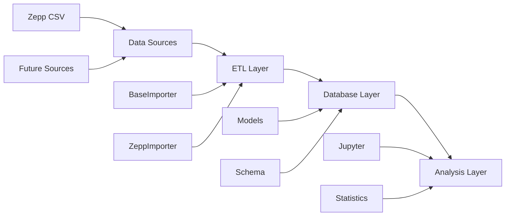

# Health Data Analytics System Documentation

Welcome to the comprehensive documentation for the Health Data Analytics System.

## 📚 Documentation Overview

### 🏗️ [Architecture](architecture.md)
Complete system architecture documentation including:
- System architecture diagrams
- Database schema with ERD
- Design patterns and extensibility points
- Performance and security considerations

### 🚀 Quick Start Guide
For immediate setup and usage, see the main [README.md](../README.md)

## 📊 System Overview

The Health Data Analytics System is designed with a modular, extensible architecture supporting multiple health data types and sources.

### Architecture at a Glance



### Current Status

✅ **Implemented**:
- Multi-table database schema (users, daily_activity, sleep_data, heart_rate_data)
- Zepp CSV importers (activity and sleep data)
- Extensible importer architecture
- Data validation and error handling
- Command-line tools for all operations
- Comprehensive analysis notebooks

🚧 **Ready for Extension**:
- Heart rate data import (schema exists)
- Additional data sources (Fitbit, Apple Health, etc.)
- Advanced analytics and machine learning

## 🛠️ Developer Guide

### Project Structure
```
healthdatabase/
├── docs/                 # 📚 Documentation
│   ├── README.md         # This file
│   └── architecture.md   # System architecture
├── src/                  # 💻 Source code
│   ├── database/         # Database models and schema
│   ├── etl/             # Data import and transformation
│   └── utils/           # Utilities and configuration
├── scripts/             # 🔧 Command-line tools
├── notebooks/           # 📊 Jupyter analysis notebooks
└── data/                # 💾 Database and processed data
```

### Key Components

#### Database Layer
- **Models**: Abstract base classes with validation
- **Schema Management**: Automated table creation and migrations
- **Connection**: Robust SQLite connection handling

#### ETL Layer
- **Base Importers**: Abstract interfaces for all data sources
- **Source-Specific Importers**: Zepp, future Fitbit, Apple Health, etc.
- **Validation Pipeline**: Comprehensive data cleaning and validation

#### Analysis Layer
- **Jupyter Notebooks**: Interactive data exploration
- **Statistical Functions**: Correlation, trend analysis, insights
- **Visualization**: Charts, graphs, and dashboards

## 📖 Available Documentation

| Document | Description |
|----------|-------------|
| [Architecture](architecture.md) | Complete system design and technical details |
| [Main README](../README.md) | Quick start guide and feature overview |

## 🤝 Contributing

When contributing to the project:

1. **Follow Architecture Patterns**: Use the established abstract base classes
2. **Update Documentation**: Keep this documentation current with changes
3. **Add Tests**: Include unit tests for new functionality
4. **Update Diagrams**: Modify architecture diagrams when adding new components

## 📧 Support

For questions about the architecture or implementation:
- Review the [Architecture Documentation](architecture.md)
- Check the main [README](../README.md) for common usage patterns
- Examine existing code for implementation examples