# Health Data Analytics System Architecture

## Overview

This document describes the architecture of the Health Data Analytics System, which follows a modular, extensible design pattern to support multiple data types and sources.

## System Architecture Diagram


## Architecture Layers

### 1. Data Sources Layer
- **Purpose**: Raw data inputs from various health tracking devices
- **Components**:
  - Zepp CSV exports (Activity, Sleep)
  - Future support for other formats (JSON, API, etc.)
- **Extensibility**: Easy to add new device types and data formats

### 2. ETL (Extract, Transform, Load) Layer
- **Purpose**: Data processing pipeline with validation and transformation
- **Components**:
  - `BaseImporter`: Abstract base class defining importer interface
  - `ZeppActivityImporter`: Handles Zepp activity data transformation
  - `ZeppSleepImporter`: Handles Zepp sleep data transformation
  - `CSVImporter` & `JSONImporter`: Format-specific base classes
- **Key Features**:
  - Data validation and cleaning
  - Batch processing for large datasets
  - Error handling and logging
  - Dry-run capability for testing

### 3. Database Layer
- **Purpose**: Data persistence with proper schema management
- **Components**:
  - `DatabaseConnection`: SQLite connection management
  - `SchemaManager`: Database schema creation and migration
  - `BaseModel`: Abstract model interface
  - Specific models for each data type
- **Key Features**:
  - ACID transactions
  - Foreign key relationships
  - Automatic timestamps
  - Index optimization

### 4. Analysis Layer
- **Purpose**: Data exploration, visualization, and insights
- **Components**:
  - Jupyter notebooks for interactive analysis
  - Statistical analysis functions
  - Visualization libraries integration
  - Trend analysis tools

## Database Schema

### Entity Relationship Diagram

```mermaid
erDiagram
    users ||--o{ daily_activity : has
    users ||--o{ sleep_data : has
    users ||--o{ heart_rate_data : has

    users {
        int id PK
        string user_id UK
        string name
        string email
        string timezone
        timestamp created_at
        timestamp updated_at
    }

    daily_activity {
        int id PK
        int user_id FK
        date date
        int steps
        float calories
        float distance
        float run_distance
        int active_minutes
        string data_source
        timestamp created_at
        timestamp updated_at
    }

    sleep_data {
        int id PK
        int user_id FK
        date date
        timestamp sleep_start
        timestamp sleep_end
        int total_sleep_minutes
        int deep_sleep_minutes
        int light_sleep_minutes
        int rem_sleep_minutes
        int wake_minutes
        float sleep_efficiency
        text naps_data
        string data_source
        timestamp created_at
        timestamp updated_at
    }

    heart_rate_data {
        int id PK
        int user_id FK
        timestamp timestamp
        int heart_rate
        int resting_hr
        int max_hr
        string data_source
        timestamp created_at
    }
```



### Table Descriptions

#### users
- **Purpose**: Store user information and settings
- **Key Fields**: user_id (unique identifier), name, email, timezone
- **Relationships**: One-to-many with all data tables

#### daily_activity
- **Purpose**: Daily activity metrics from fitness trackers
- **Key Fields**: steps, calories, distance, run_distance, active_minutes
- **Unique Constraint**: (user_id, date, data_source)

#### sleep_data
- **Purpose**: Sleep tracking data with detailed stage information
- **Key Fields**: sleep_start/end times, sleep stage durations, efficiency
- **Special Fields**: naps_data (JSON for nap information)

#### heart_rate_data
- **Purpose**: Heart rate measurements (continuous and summary)
- **Key Fields**: heart_rate, resting_hr, max_hr
- **Note**: Schema ready, awaiting data source implementation

## Design Patterns

### Abstract Factory Pattern
- **BaseImporter**: Defines interface for all importers
- **Concrete Importers**: Implement specific source logic
- **Factory Functions**: Create appropriate importer instances

### Repository Pattern
- **Models**: Define data structure and validation
- **SchemaManager**: Handles database operations
- **Connection**: Manages database connectivity

### Strategy Pattern
- **Data Validation**: Each model implements its own validation strategy
- **File Parsing**: Different strategies for CSV, JSON, etc.

## Extensibility Points

### Adding New Data Sources

1. **Create Importer Class**:
```python
class NewSourceImporter(BaseImporter):
    def get_data_source_name(self) -> str:
        return 'new_source'

    def transform_record(self, raw_record) -> Dict[str, Any]:
        # Implement transformation logic
        pass
```

2. **Update Factory Function**:
```python
def create_importer(source: str, data_type: str):
    if source == 'new_source':
        return NewSourceImporter(db_connection, model)
```

### Adding New Data Types

1. **Create Model**:
```python
class NewDataModel(BaseModel):
    def get_table_name(self) -> str:
        return "new_data_table"

    def get_create_sql(self) -> str:
        return "CREATE TABLE..."
```

2. **Register Model**:
```python
MODEL_REGISTRY['new_data'] = NewDataModel()
```

3. **Create Importer**:
```python
class NewDataImporter(CSVImporter):
    # Implement required methods
    pass
```

## Data Flow

### Import Process
1. **File Validation**: Check file format and accessibility
2. **Parsing**: Extract raw records from source file
3. **Transformation**: Convert to standard format
4. **Validation**: Validate data integrity and constraints
5. **Batch Processing**: Insert/update records in batches
6. **Logging**: Track progress and errors

### Query Process
1. **Connection**: Establish database connection
2. **Query Execution**: Run SQL queries with proper error handling
3. **Result Processing**: Convert to appropriate data structures
4. **Analysis**: Apply statistical functions and visualizations

## Performance Considerations

### Database Optimizations
- **Indexes**: Created on frequently queried columns (date, user_id)
- **Batch Inserts**: Process records in configurable batch sizes
- **Connection Pooling**: Efficient connection management
- **Query Optimization**: Use prepared statements and proper joins

### Memory Management
- **Streaming Processing**: Process large files without loading entirely into memory
- **Generator Functions**: Yield records one at a time during parsing
- **Batch Size Configuration**: Adjustable based on available memory

## Security Considerations

### Data Protection
- **Input Validation**: Comprehensive validation of all inputs
- **SQL Injection Prevention**: Use parameterized queries
- **File Access Control**: Validate file paths and permissions
- **Error Handling**: Avoid exposing sensitive information in errors

### Future Enhancements
- **User Authentication**: Multi-user support with proper access controls
- **Data Encryption**: Encrypt sensitive health data at rest
- **Audit Logging**: Track all data access and modifications

## Monitoring and Logging

### Logging Strategy
- **Structured Logging**: Consistent log format across all components
- **Log Levels**: Appropriate use of DEBUG, INFO, WARNING, ERROR
- **Performance Metrics**: Track import speeds and query performance
- **Error Tracking**: Detailed error information for debugging

### Health Checks
- **Database Connectivity**: Verify database is accessible
- **Schema Validation**: Ensure all required tables and indexes exist
- **Data Integrity**: Validate foreign key relationships
- **Performance Monitoring**: Track query execution times